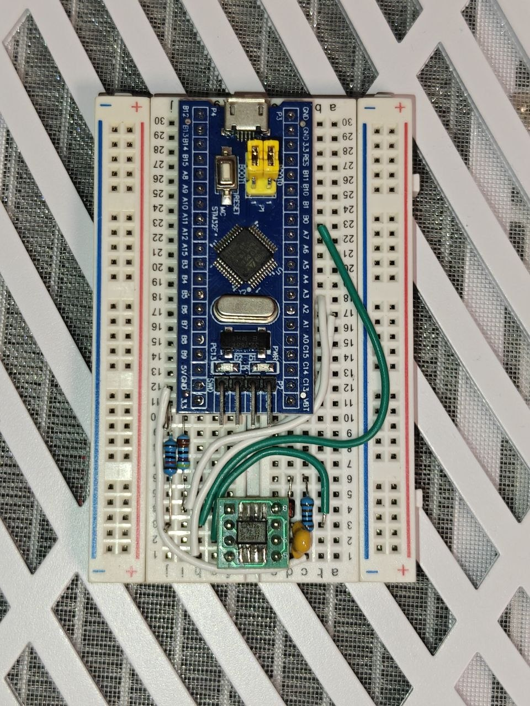
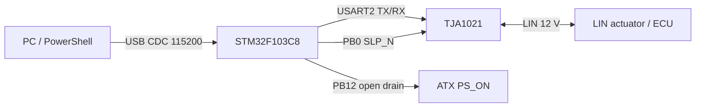

# LIN Control


**LIN Control** — рабочий стендовый интерфейс для связи ПК с автомобильным LIN-устройством через STM32F103C8 и трансивер TJA1021. Прототип формирует LIN Break/Sync/PID, передаёт кадры, читает ответы ведомого узла, проверяет эхо и checksum, ведёт циклический опрос статусов и безопасно управляет питанием стенда.

Проект выполнил задачу связи: получен стабильный двусторонний канал **PC → USB CDC → STM32 → TJA1021 → LIN**, подтверждены ответы устройства на трёх идентификаторах и реализован воспроизводимый диагностический интерфейс.



## Возможности

- LIN master на скоростях **9600 / 10400 / 19200 бод**;
- аппаратный 13-битный LIN Break через USART2 STM32;
- classic и enhanced checksum;
- отправка произвольного master frame и чтение slave response;
- диагностические запросы LIN по ID `0x3C/0x3D`;
- очереди кадров и детерминированный циклический планировщик;
- проверка эха, UART framing/noise/overrun и переполнения буфера;
- USB CDC протокол для управления с ПК;
- управление `PS_ON` открытым стоком;
- независимая аренда питания на 3 секунды: при потере USB или heartbeat питание отпускается;
- автоматическое отключение при ошибке транспорта или обнаружении заданного статуса.

## Архитектура



## Аппаратная часть

| STM32F103C8 | TJA1021 / стенд | Назначение |
|---|---|---|
| PA2 | TXD, pin 4 | передача USART2 |
| PA3 | RXD, pin 1 | приём USART2 |
| PB0 | SLP_N, pin 2 | включение трансивера |
| GND | GND, pin 5 | общая земля |
| — | LIN, pin 6 | линия LIN |
| — | VBAT, pins 3 + 7 | питание 12 В |
| PB12 | ATX PS_ON | запрос питания, open drain |

Логическая сторона работает от 3,3 В. На RXD и SLP_N использованы подтяжки к 3,3 В. Типовая LIN-обвязка содержит диод, master pull-up и развязывающий конденсатор по документации TJA1021. Полная схема и порядок включения приведены в [docs/hardware.md](docs/hardware.md).

## Быстрый старт

### 1. Сборка прошивки

Требуются Arduino CLI и STM32 Arduino core:

```powershell
./firmware/build.ps1
```

Скетч собирается для Blue Pill STM32F103C8 с native USB CDC и загрузкой через ST-Link/OpenOCD. Скрипт только компилирует прошивку и не выполняет прошивку микроконтроллера.

### 2. Проверка интерфейса

```powershell
./host/lin-console.ps1 -Port COM4 -Action Info
./host/lin-console.ps1 -Port COM4 -Action Poll -Id 14 -Power
./host/lin-console.ps1 -Port COM4 -Action Monitor -Seconds 10 -Power
```

Ключ `-Power` явно разрешает включение 12-вольтового стенда. После завершения команды или ошибки консоль отправляет `STOP`, а встроенная в прошивку трёхсекундная аренда питания отключает БП при потере связи с ПК.

Пример подтверждённого обмена:

```text
STM32_LIN_10 READY DISABLED
PONG STM32_LIN_10
RESULT TX=5514 RAW=5514... ECHO=OK CAPTURE_OVERFLOW=0 UART_ERRORS=0
```

## Подтверждённые кадры

На стенде устройство стабильно отвечало на следующие master headers:

| ID | Назначение в прототипе | Значимые байты правого положения |
|---:|---|---|
| `0x14` | основной статус | `00 00 78 00 E4 FF 1F` |
| `0x1E` | дополнительный статус | `00 01 FE FF FF FF FF` |
| `0x32` | состояние/позиция | `50 FE FF FF FF FF FF` |

Каждый ответ содержит собственные counter/CRC поля и внешний LIN checksum. Декодирование, таблицы DataID и правила проверки описаны в [docs/protocol.md](docs/protocol.md), а машиночитаемые значения находятся в [data/status-frames.json](data/status-frames.json).

## Структура

```text
Lin-Control/
├── assets/                     фото прототипа
├── data/                       подтверждённые кадры и CRC-таблицы
├── docs/                       схема, протокол и результаты
├── firmware/
│   ├── build.ps1               сборка через Arduino CLI
│   └── lin_control/             прошивка STM32
└── host/
    └── lin-console.ps1          безопасная консоль ПК
```

## Результат

Прототип подтвердил физический и канальный уровни LIN, устойчивую передачу master frames, получение slave responses и управление питанием с fail-safe таймером. Эти компоненты образуют готовую основу для диагностики, записи трафика и интеграции LIN-устройств в стендовые проекты.

## Документация

- [Схема и подключение](docs/hardware.md)
- [USB/LIN протокол](docs/protocol.md)
- [Проверки и результаты](docs/validation.md)
- [Источники](docs/references.md)
